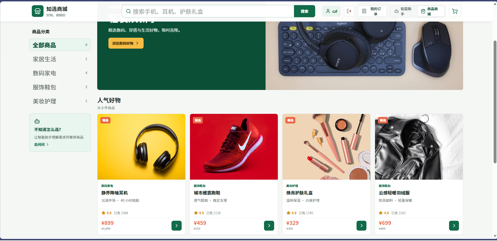
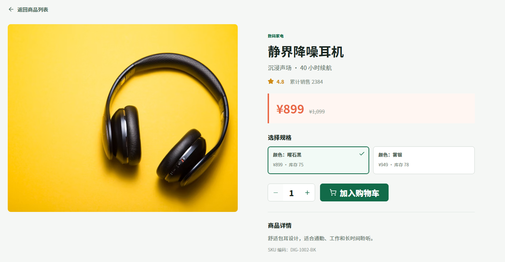
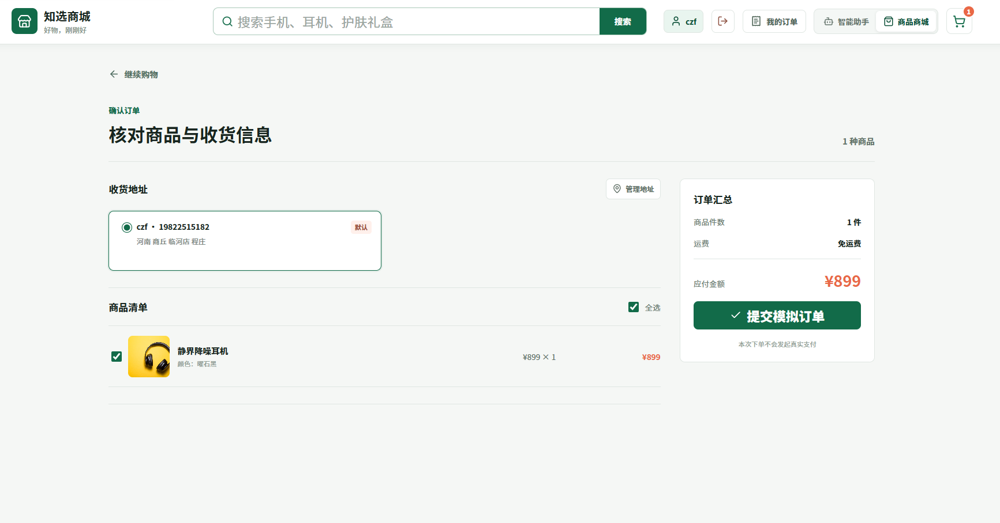
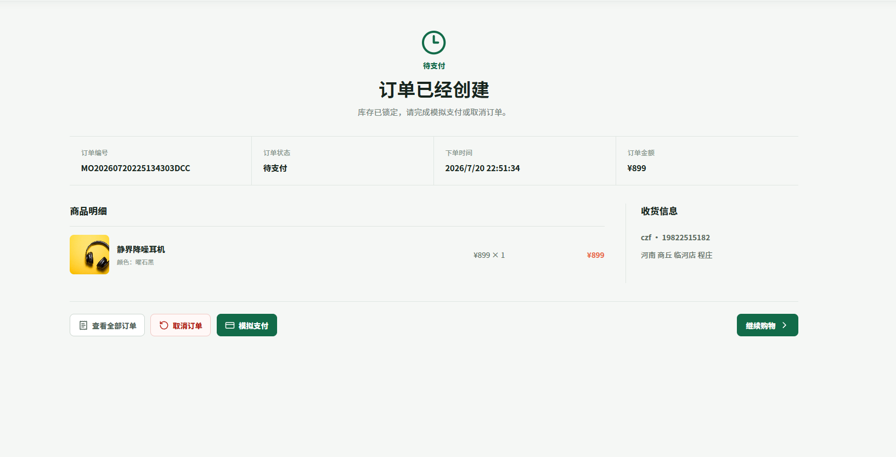
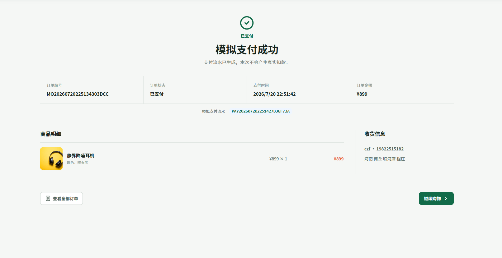

# FirstRag-mall

FirstRag-mall 是一个基于 Spring Boot 4、Spring AI 2 和 Milvus 的 RAG（检索增强生成）示例项目，融合了多模态检索、模型路由熔断、分布式限流、电商交易闭环和 Ragas 评估体系，演示如何将大模型、向量数据库和业务数据结合起来，构建可扩展的智能问答与商品搜索体验。

## RAG问答界面

## 商城购物界面


## 项目简介

这个项目包含以下核心能力：

- 基于 Spring AI 的聊天接口，支持接入 DashScope / OpenAI 兼容模型
- 文本 RAG：将文档向量化后写入 Milvus，并通过检索生成回答
- 图片 RAG：基于 DashScope 多模态 Embedding 的商品图片向量检索与相似图搜索
- Markdown 知识入库：解析本地 Markdown 文件，按文档类型（说明书/品牌故事/活动规则）分类写入向量库
- RAG 查询预处理：意图识别、查询改写与元数据过滤表达式生成
- 模型路由与熔断降级：多候选端点优先级路由，三态熔断器（CLOSED/OPEN/HALF_OPEN）自动 failover，支持运行时故障注入调试
- 分布式队列限流：基于 Redis ZSET + Lua 原子脚本 + Redisson Pub/Sub 的并发控制与请求节流
- 知选商城：完整的电商前端与后端，包含商品浏览、SKU 选择、购物车、订单与模拟支付
- 商品搜索索引同步（Outbox 模式）：商品变更写入 Outbox 事件表，定时任务异步同步到 Milvus 搜索索引，支持重试退避与 SHA-256 版本对账
- 商品推荐引擎：融合 RAG 语义分数与 MySQL 词法匹配，支持预算与分类过滤
- 检索结果重排：基于 RerankModel 对召回结果进行二次排序
- Ragas 评估体系：对 RAG 效果进行多轮评估，覆盖 faithfulness / answer_relevancy / context_precision / context_recall
- Spring Security 会话认证：BCrypt 密码加密、Cookie CSRF 保护、接口级权限控制
- 前端交互界面：使用 React + Vite 提供可视化访问入口（智能助手 + 知选商城）

## 主要技术栈

### 后端

- Java 21
- Maven
- Spring Boot 4.1.0
- Spring AI 2.0.0（OpenAI 兼容模型 + Milvus 向量存储）
- Spring Security + Session（会话认证、CSRF、BCrypt）
- Spring Data JPA (Hibernate)
- Spring Data Redis
- MySQL 8
- Milvus 2.6
- Redisson 3.52.0（分布式队列限流的 Pub/Sub 与同步原语）
- DashScope SDK Java 2.22.24（多模态对话、文本 Embedding、多模态 Embedding）

### 前端

- React + Vite 5 + TypeScript
- lucide-react（图标库）

### 评估

- Python + Ragas（RAG 效果评估）

### 测试

- JUnit 5 + Mockito
- H2（测试内存数据库）

## 项目结构

```text
src/main/java/com/example/ragdemo
  config/             # AI 配置、模型路由装配、图片 RAG 配置、搜索索引配置
  controller/         # REST Controller：聊天、RAG、图片检索、商城、健康检查、模型调试
  service/            # 业务服务层：RAG 引擎、商城对话编排、图片 RAG、Markdown 入库、查询预处理、商品推荐、搜索索引同步
  routing/            # 模型路由与熔断：ModelRouter、CircuitBreaker、故障注入、路由追踪
  ratelimit/          # 分布式队列限流：ZSET 队列 + Lua 脚本 + Redisson Pub/Sub + REST 演示端点
    config/           # 限流配置与 Redisson 客户端
    core/             # 限流核心：队列、许可证、状态机、信号总线
    support/          # Redis Lua Repository 与 Redisson 信号总线实现
    exception/        # 限流异常（超时、取消、不可用）
    dto/              # 限流请求与响应 DTO
    controller/       # 限流演示端点
  rerank/             # 检索结果重排模型（接口 + 透传实现）
  dashscope/          # DashScope 原生适配：多模态对话、文本 Embedding、多模态 Embedding
  store/              # 知选商城：商品、SKU、购物车、订单、用户、地址、安全配置、Outbox 事件
  dto/                # 请求与响应 DTO（聊天、RAG、商城对话、图片 RAG、商品推荐）
  exception/          # 全局异常处理（@RestControllerAdvice）
frontend/             # React + Vite 前端项目（智能助手 + 知选商城）
docs/                 # 项目说明文档与截图
doc/                  # 设计文档（高层设计、详细设计、提案、Prompt 设计）
text/                 # 示例 Markdown 知识库（说明书、品牌故事、活动规则）
eval/                 # Ragas 评估脚本、数据集与历史结果
volumes/              # Milvus 持久化数据（Docker 卷）
```

## 环境依赖

在启动项目前，请确保以下依赖可用：

- JDK 21
- Maven 3.8+（推荐 3.9+）
- MySQL 8（商城数据持久化）
- Redis（分布式限流与 Session 共用）
- Milvus 2.6（向量检索，依赖 etcd 作为元数据存储）
- DashScope / OpenAI 兼容模型 API Key
- Node.js 18+ 与 npm（前端构建与运行）
- Python 3.10+（可选，用于 Ragas 评估）

## 配置说明

项目配置文件位于 [src/main/resources/application.yml](src/main/resources/application.yml)。

建议在启动前设置以下环境变量（PowerShell 示例）：

```powershell
$env:DASHSCOPE_API_KEY="your-api-key"
$env:DASHSCOPE_BASE_URL="https://dashscope.aliyuncs.com/compatible-mode/v1"
$env:DASHSCOPE_MODEL="qwen3.7-max"
$env:DASHSCOPE_EMBEDDING_MODEL="qwen3.7-text-embedding"
$env:DASHSCOPE_EMBEDDING_DIMENSIONS="1024"
$env:MILVUS_HOST="localhost"
$env:MILVUS_PORT="19530"
$env:APP_REDIS_URL="redis://localhost:6379"
$env:APP_MYSQL_URL="jdbc:mysql://localhost:3306/first_rag_mall?createDatabaseIfNotExist=true&useUnicode=true&characterEncoding=utf8&serverTimezone=Asia/Shanghai"
$env:APP_MYSQL_USERNAME="root"
$env:APP_MYSQL_PASSWORD="123456"
```

## 启动方式

### 1. 启动后端

在项目根目录执行：

```powershell
mvn spring-boot:run
```

服务默认运行在：

- http://localhost:8080

### 2. 启动前端

```powershell
cd frontend
npm install
npm run dev
```

前端默认地址：

- 智能助手：http://localhost:5173
- 知选商城：http://localhost:5173/mall

## 知选商城

项目内置了完整的电商模块「知选商城」，与智能助手共享同一套后端服务。商城数据通过 JPA 持久化到 MySQL，支持商品浏览、规格选择、购物车、订单与模拟支付全流程。

### 商城首页

左侧为商品分类导航（全部商品、家居生活、数码家电、服饰鞋包、美妆护理），右侧展示精选 Banner 与商品卡片列表，支持关键词搜索与分类筛选。



### 商品详情与 SKU 选择

商品详情页展示大图、评分、累计销量、SKU 规格选择与库存信息。用户可选择不同规格（如颜色）并调整数量后一键加入购物车。



### 购物车

购物车以侧边抽屉形式呈现，支持数量增减、单品删除和一键去结算。购物车数据持久化到服务端，登录后跨页面保留。

### 订单确认与模拟支付

结算页展示收货地址选择、商品清单勾选与订单金额汇总。提交订单后进入订单详情页，可进行「模拟支付」或「取消订单」。支付与取消均通过悲观锁保证并发安全。







### 用户与订单管理

- **用户认证**：基于 Spring Security Session，支持注册、登录、登出，密码使用 BCrypt 加密
- **个人中心**：可修改昵称与手机号
- **收货地址**：支持新增、编辑、删除、设为默认地址
- **订单中心**：按全部 / 待支付 / 已支付 / 已取消筛选订单，支持支付与取消操作

### 商城技术结构

```text
store/
  StoreController          # 商品与分类查询 API
  StoreCommerceController  # 购物车与订单 API
  StoreAccountController   # 用户资料 API
  StoreAddressController   # 收货地址 API
  StoreAuthController      # 登录/注册/登出/CSRF
  StoreSecurityConfig      # Spring Security 配置
  StoreProductService      # 商品与分类业务
  StoreCartService         # 购物车业务（库存校验）
  StoreOrderService        # 订单业务（下单、支付、取消）
  StoreUserService         # 用户业务
  StoreAddressService      # 地址业务
  StoreDataInitializer     # 演示数据初始化
  StoreProductCatalogService / StoreProductSearchIndexService  # 搜索索引与同步
```

## 功能演示

本项目支持多种交互模式，包括文本搜索、图片搜索和对话推荐。以下是实际运行效果演示：

### 1. 系统启动

```powershell
PS D:\downfile\FirstRag> $env:DASHSCOPE_API_KEY="your-api-key"
PS D:\downfile\FirstRag> $env:APP_VECTORSTORE_TYPE="milvus"
PS D:\downfile\FirstRag> mvn spring-boot:run
```

后端成功启动后，访问前端地址即可开始使用。

### 2. 前端交互界面

项目提供了一个现代化的 Web UI，用户可以通过以下方式与系统交互：


**功能模块：**
- 📱 给我找一款手机 - 文本驱动的手机搜索
- 💄 展示化妆品 - 化妆品分类和搜索
- 🧥 找一件羽绒服 - 衣服分类和查询
- 🔗 相似图片搜索 - 上传图片找相似产品

**交互流程示例：**

**场景 1: 文本搜索手机**
- 用户输入："给我找一款手机"
- 系统通过向量检索返回相关手机商品
- 展示多个手机图片选项（商品 ID: P10001, P10002, P10003 等）


**场景 2: 图片搜索衣服**
- 用户输入："给我推荐一下类似的衣服"
- 系统识别图片内容（例如黄色羽绒服）
- 返回相似的衣服产品列表（Down jacket, Clothes image 等）


**场景 3: 自然对话推荐**
- 用户提问："你们还有哪些商品"
- 系统列出商品库中的所有分类
- 返回包括：
  - 📱 数码类产品：手机、电脑、耳机、智能设备
  - 👔 服饰鞋包：男女衣、鞋、箱包、配件
  - 💄 美妆个护：护肤品、彩妆、香水、洗护用品
  - 🏠 家居生活：家具、家纺、日用百货、厨具
  - 🍔 食品母婴：食品、母婴用品等
  


## 核心功能

### 1. 多模式搜索能力

**文本搜索**
- 用户输入自然语言查询
- 系统通过向量化检索找到相关商品
- 支持复杂的商品描述理解

**图片搜索**
- 支持上传图片进行相似度搜索
- 使用 DashScope 多模态 Embedding (qwen3-vl-embedding)
- 快速找到相似的商品图片

**对话推荐**
- 支持多轮对话，系统记忆上文
- 基于用户需求动态生成推荐
- 支持产品分类导航

### 2. 向量检索与重排

- **向量存储**：使用 Milvus 存储文档和图片向量
- **相似度计算**：支持 COSINE 距离度量
- **重排优化**：基于 RerankModel 进行二次排序，提升相关性
- **动态过滤**：支持 Milvus 过滤表达式（如按分类、价格等）

### 3. 模型路由与容错

项目支持多个 AI 模型的并行配置和自动降级：

```
聊天模型候选：
├── chat-primary: qwen3.7-max (优先级 100)
└── chat-qwen35-plus: qwen3.5-plus (优先级 200)

Embedding 模型候选：
├── embedding-primary: qwen3.7-text-embedding (DashScope 原生，优先级 100)
└── embedding-text-v3: text-embedding-v3 (优先级 200)
```

当主模型失败次数超过阈值时，系统自动切换到备选模型。

### 4. 分布式限流

基于 Redis 的队列式限流：
- 支持并发数控制
- 支持请求节流
- 可为不同业务模块配置不同限流策略
- 示例配置：
  ```
  chat: max-concurrent: 2
  rag: max-concurrent: 1
  ```

### 5. 数据持久化层

项目使用 **Spring Data JPA + MySQL** 持久化商城业务数据：

| 实体 | 说明 |
|---|---|
| `StoreProduct` | 商品主信息（名称、分类、价格、销量等） |
| `StoreSku` | SKU 规格（颜色、库存、独立价格等） |
| `StoreCartItem` | 购物车项（关联用户与 SKU） |
| `StoreOrder` / `StoreOrderItem` | 订单与订单明细快照 |
| `StoreUser` | 商城用户（用户名、昵称、密码哈希） |
| `StoreAddress` | 收货地址（收件人、电话、省市区与详细地址） |

### 6. 用户认证与安全

- 基于 **Spring Security Session** 的无状态表单认证替代方案
- 密码使用 **BCrypt** 哈希存储
- **Cookie CSRF Token** 保护写接口
- 公开接口（商品浏览、聊天）免登录；购物车、订单、地址等需认证
- 所有用户相关接口通过 `CurrentStoreUser` 边界读取当前用户，拒绝客户端传入用户 ID

### 7. Markdown 知识入库

后端支持从本地 Markdown 文件批量解析并写入 Milvus 向量库：

- 自动解析 Markdown 标题层级生成结构化内容
- 支持按文件批量入库
- 入库内容可用于后续 RAG 问答

### 8. 商品搜索索引同步（Outbox）

商城模块实现了 Outbox 模式用于商品搜索索引的异步同步：

- 商品变更时写入 Outbox 事件表
- 定时任务异步消费事件并同步到搜索索引
- 支持重试、对账与批量处理，保证索引与数据库最终一致

## Ragas 评估结果

项目使用 Ragas 对文本 RAG 效果进行了多轮评估。评估集位于 [eval/eval_dataset.jsonl](eval/eval_dataset.jsonl)，知识库种子数据位于 [eval/knowledge_seed.json](eval/knowledge_seed.json)。评估指标包括：

- `faithfulness`：回答是否忠实于检索上下文
- `answer_relevancy`：回答是否切中用户问题
- `context_precision`：检索上下文是否足够精准
- `context_recall`：是否召回了回答所需的关键信息
- `rows_without_context`：没有检索到上下文的评估条数

### 多轮评估对比

| 评估时间 | faithfulness | answer_relevancy | context_precision | context_recall | 无上下文行数 | 说明 |
|---|---:|---:|---:|---:|---:|---|
| 2026-07-12 13:07 | 0.4319 | 0.5963 | 0.4000 | 0.4000 | 16 | 初始效果较差，大量问题没有检索到上下文 |
| 2026-07-12 15:18 | 0.7271 | 0.6737 | 0.6722 | 0.7167 | 5 | 调整距离阈值和知识内容后，召回明显改善 |
| 2026-07-12 15:52 | 0.8432 | 0.7009 | 0.7741 | 0.9000 | 2 | 元数据进入上下文后，整体进入可用状态 |
| 2026-07-12 17:00 | 0.8284 | 0.7817 | 0.8556 | 0.9222 | 2 | 加入商品编号精确检索、类别预算重排后，相关性和上下文质量继续提升 |

### 评估结论

整体看，项目的 RAG 效果已经从"检索不稳定"提升到"基本可用，并能处理商品编号、预算、类别推荐问题"：

- `context_recall` 从 `0.4000` 提升到 `0.9222`，说明大多数问题已经可以召回正确知识。
- `answer_relevancy` 从 `0.5963` 提升到 `0.7817`，回答与用户问题的匹配度明显提升。
- `context_precision` 从 `0.4000` 提升到 `0.8556`，检索上下文的噪声显著减少。
- `rows_without_context` 从 `16/30` 降到 `2/30`，无上下文回答大幅减少。

最后一轮 `faithfulness` 从 `0.8432` 小幅下降到 `0.8284`，但实际业务效果更好，因为两个真实错误已经被修复：

| 问题 | 修改前 | 修改后 |
|---|---|---|
| `P10001 这款商品适合什么用户？` | 错误回答"知识库没有 P10001" | 正确回答适合轻薄机身、日常拍照、稳定续航用户 |
| `有没有 500 元以内的服饰鞋包商品？` | 错误回答没有相关商品 | 正确推荐 P20001 黄色轻薄羽绒服和 P20002 白色休闲运动鞋 |
| 医疗诊断 / 法律代理 | 兜底回答较泛 | 明确说明不属于当前商品知识库范围 |

需要注意：医疗诊断、法律代理这类范围外问题，本项目会正确拒答，但由于没有检索上下文，Ragas 的 `faithfulness`、`context_precision`、`context_recall` 可能会给 0。这类问题更适合单独用规则评估，而不是只看 Ragas 上下文指标。

后续优化方向是：当检测到"商品编号"或"类别 + 预算"明确命中时，只把匹配商品上下文传给模型，进一步减少推荐题中的无关商品上下文，提升 `context_precision`。

## 使用场景

这个项目适用于以下场景：

1. **电商推荐系统** - 基于用户描述和图片快速推荐商品
2. **商品搜索引擎** - 支持多模态搜索和智能问答
3. **客服助手** - 为用户快速查找相关商品和回答常见问题
4. **库存管理** - 支持文本和图片的库存检索
5. **演示商城** - 可作为具备完整购物流程的示例电商平台

## 主要接口示例

### 健康检查

```bash
curl http://localhost:8080/api/health
```

### 基础聊天

```bash
curl -X POST http://localhost:8080/api/chat \
  -H "Content-Type: application/json" \
  -d '{"message":"你好，请介绍一下你自己"}'
```

### 文本 RAG 入库

```bash
curl -X POST http://localhost:8080/api/rag/documents \
  -H "Content-Type: application/json" \
  -d '{"content":"Milvus 是一个向量数据库，适合做 RAG 检索。","source":"manual-test"}'
```

### 文本 RAG 检索

```bash
curl -X POST http://localhost:8080/api/rag/search \
  -H "Content-Type: application/json" \
  -d '{"message":"Milvus 的用途是什么？","topK":3}'
```

### 图片 RAG 检索

```bash
curl -X POST http://localhost:8080/api/mall/images/search \
  -H "Content-Type: application/json" \
  -d '{"query":"blue phone product image","topK":5}'
```

### 商城商品列表

```bash
curl "http://localhost:8080/api/store/products?category=数码家电"
```

### 商城下单

```bash
curl -X POST http://localhost:8080/api/store/orders \
  -H "Content-Type: application/json" \
  -d '{"cartItemIds":[1,2],"addressId":1}'
```

### 模拟支付

```bash
curl -X POST http://localhost:8080/api/store/orders/1/pay
```

## 主要技术内容

1. **Spring AI 集成**
   - 使用 ChatClient 进行大模型调用
   - 支持向量检索与上下文增强生成

2. **Milvus 向量数据库**
   - 存储文档和图片向量
   - 支持相似度搜索与召回

3. **模型路由与容错**
   - 可配置多个模型候选项
   - 支持失败阈值与开放时长控制

4. **Redis 分布式限流**
   - 基于队列和 Redis 的并发控制与请求节流

5. **Spring Data JPA 实体层**
   - 商品、SKU、购物车、订单、用户、地址全实体映射
   - 下单与支付使用悲观锁保证并发安全

6. **Spring Security 会话认证**
   - Session + Cookie 认证机制
   - CSRF Token 保护写接口
   - 接口级权限控制

7. **前端可视化支持**
   - 基于 React + Vite 提供交互式体验
   - 单页应用路由分派（智能助手 / 知选商城）

## 部署与扩展

### Docker 容器化

如果你想将项目容器化，可以为后端和前端分别创建 Dockerfile：

```dockerfile
# 后端 Dockerfile
FROM eclipse-temurin:21-jdk-alpine
WORKDIR /app
COPY target/spring-ai-rag-demo-0.0.1-SNAPSHOT.jar app.jar
ENTRYPOINT ["java", "-jar", "app.jar"]
```

### 生产环境建议

1. **API 安全**
   - 使用 API Key 认证
   - 限制请求频率和大小

2. **数据治理**
   - 定期清理过期向量
   - 优化 Milvus 索引
   - 备份知识库数据

3. **监控告警**
   - 监控模型调用延迟
   - 监控向量检索效率
   - 记录系统错误日志

4. **性能优化**
   - 使用 CDN 加速图片访问
   - 优化向量检索参数（topK、距离阈值）
   - 启用 Redis 缓存热点数据

## 常见问题

**Q: 如何更换大模型供应商？**
A: 编辑 `application.yml` 中的 `app.ai` 配置，更改 `base-url` 和 `api-key`。

**Q: 向量维度不匹配如何处理？**
A: 确保 `DASHSCOPE_EMBEDDING_DIMENSIONS` 与 `MILVUS_EMBEDDING_DIMENSION` 一致，并与实际 embedding 模型的输出维度相符。

**Q: 如何调试限流问题？**
A: 检查 Redis 连接和配置中的 `app.ratelimit` 参数，查看 `RateLimitController` 的响应。

**Q: 可以离线使用吗？**
A: 不可以。系统需要：
- 网络连接到 DashScope / OpenAI API
- 连接到 Milvus 向量数据库
- 连接到 Redis 实例
- 连接到 MySQL 数据库

## 文件组织建议

如果你想在项目中保存演示截图，建议按以下结构组织：

```
docs/
  screenshots/
    01-backend-startup.png       # 后端启动界面
    02-frontend-home.png         # 前端首页
    03-phone-search.png          # 手机搜索结果
    04-clothes-search.png        # 衣服搜索结果
    05-similar-image-search.png  # 相似图片搜索
    06-chat-recommendation.png   # 聊天推荐效果
    mall-homepage.png            # 知选商城首页
    mall-product-detail.png      # 商品详情页
    mall-checkout.png            # 订单确认页
    mall-order-created.png       # 订单创建成功
    mall-payment-success.png     # 模拟支付成功
  README-Screenshots.md          # 截图说明文档
```


- 文档解析与批量导入
- 权限与用户认证
- 日志与监控
- 向量索引优化与数据治理
